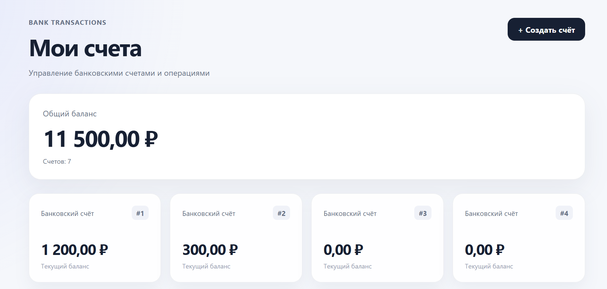
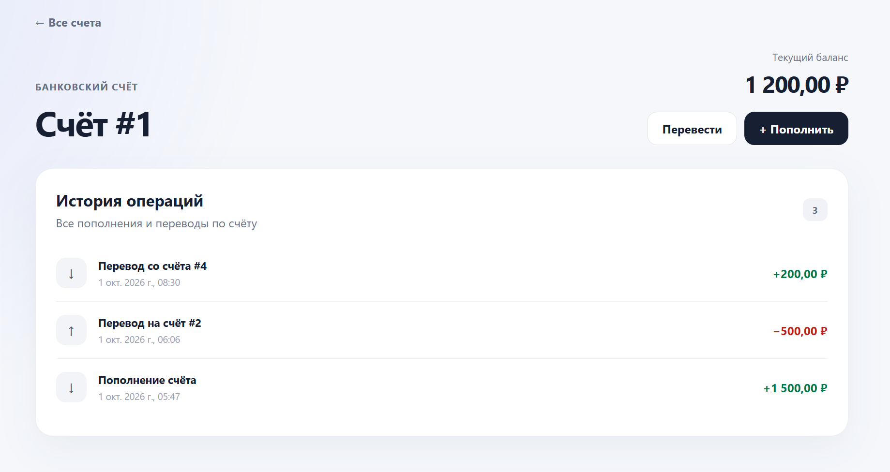
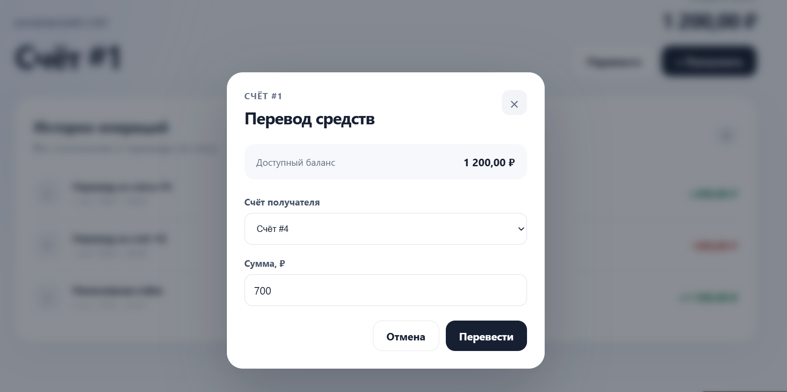

# Bank Transactions

Fullstack-приложение для работы с банковскими счетами и денежными операциями.

Проект разработан на **Go, PostgreSQL, React, TypeScript и Docker**. 
Основной акцент сделан на backend-разработке, корректности денежных операций, работе с базой данных и тестировании.
Скриншоты приложения расположены в `docs/screenshots`
> Демонстрационный проект, созданный для практического изучения Go backend-разработки и демонстрации навыков.

### Главная страница



## Функциональность

В приложении реализовано:

- создание банковских счетов;
- просмотр счетов и текущего баланса;
- пополнение счёта;
- перевод средств между счетами;
- проверка достаточности средств;
- защита от перевода на тот же счёт;
- история операций;
- входящие и исходящие переводы;
- единый формат ошибок API;
- health/readiness endpoints;
- React-интерфейс для работы со счетами и операциями.

Денежные суммы хранятся в **копейках (`int64`)**, без использования `float`, чтобы избежать ошибок округления.

## Архитектура

```text
React + TypeScript
        ↓
      Nginx
        ↓
    Go REST API
        ↓
 Repository layer
        ↓
   PostgreSQL
```

Backend разделён на HTTP-, domain- и repository-уровни.
Для уменьшения зависимости HTTP-слоя от реализации базы данных используется интерфейс `accountStore`.
В production подобном Docker окружении Nginx раздаёт React-приложение и проксирует `/api/*` в Go API.

### Счёт и история операций



## Работа с транзакциями

Пополнения и переводы выполняются через PostgreSQL-транзакции.

При переводе:

```text
BEGIN
  ↓
блокировка счетов
  ↓
проверка баланса
  ↓
списание
  ↓
зачисление
  ↓
запись операции
  ↓
COMMIT
```

Для блокировки используется:
```sql
SELECT ... FOR UPDATE
```

При переводе два счёта блокируются в одинаковом порядке по `id`. Это уменьшает риск взаимных блокировок при одновременных встречных переводах.
При ошибке операция откатывается целиком.

### Перевод средств



## API

Основные endpoints:

```text
GET  /health
GET  /ready

POST /accounts
GET  /accounts
GET  /accounts/{id}

POST /accounts/{id}/deposit
POST /transfers

GET  /accounts/{id}/transactions
```

Для ручного тестирования и проверки REST API также использовал **Postman**.

## Тестирование

В проекте реализовано несколько уровней тестирования.

### Unit tests

Проверяется доменная логика:

- успешное пополнение;
- нулевая и отрицательная сумма;
- переполнение баланса;
- успешное списание;
- недостаточный баланс.

### HTTP tests

Через `httptest` и fake-реализацию repository проверяются HTTP handlers и ответы API, включая:

```text
201 Created
400 Bad Request
404 Not Found
405 Method Not Allowed
422 Unprocessable Entity
```

### Integration tests

Repository тестируется с реальной PostgreSQL.

Интеграционный тест перевода проверяет:

- изменение балансов обоих счетов;
- создание транзакции;
- сохранение общей суммы денег до и после перевода;
- rollback при недостаточном балансе.

Запуск:

```bash
go test ./... -v
go test -tags=integration ./internal/repository -v
```

Frontend дополнительно проверяется production-сборкой:

```bash
cd frontend
npm run build
```

## Технологии

**Backend:** Go, `net/http`, `database/sql`, pgx  
**Database:** PostgreSQL  
**Frontend:** React, TypeScript, Vite, Axios, React Router  
**Infrastructure:** Docker, Docker Compose, Nginx  
**Testing:** Go `testing`, `httptest`, integration tests, Postman


## Для чего создан проект

Проект создан для практического изучения backend-разработки на Go после опыта работы с другими backend-технологиями.

Основные темы, которые отрабатывались в проекте:

- REST API;
- Go и `net/http`;
- PostgreSQL;
- SQL-транзакции;
- блокировки и конкурентный доступ;
- разделение приложения на слои;
- обработка ошибок;
- unit, HTTP и integration testing;
- Docker;
- взаимодействие Go API с React frontend.

## Ограничения и развитие

Проект является демонстрационным MVP и не предназначен для использования как реальная банковская система.

В дальнейшем можно добавить:

- пользователей, аутентификацию и авторизацию;
- владельцев банковских счетов;
- idempotency keys для защиты от повторных денежных операций;
- пагинацию истории;
- OpenAPI / Swagger;
- rate limiting;
- structured logging и метрики;
- дополнительные тесты конкурентных переводов.

## Автор

**Arsen Mikailov** - **Ars-Mik**
GitHub: [github.com/Ars-Mik](https://github.com/Ars-Mik)